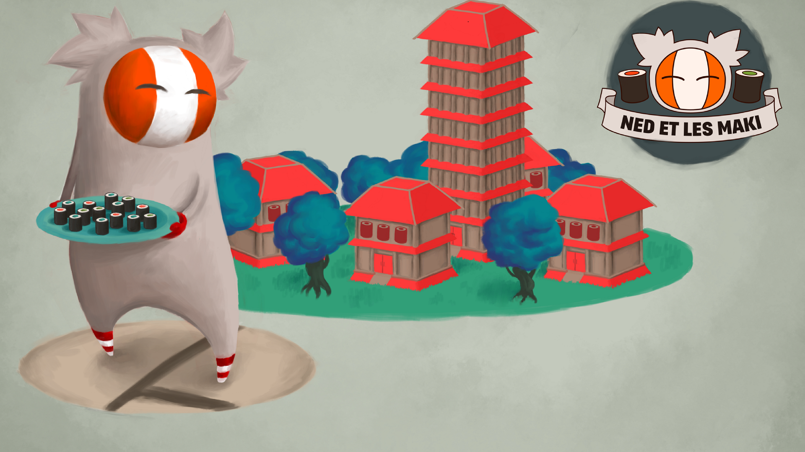

Ned et les maki
===============

Ned et les maki is an opensource puzzle game with isometric 3d graphics inspired by Sokoban.

[Official site](http://en.geekygoblin.org/ned-et-les-maki)

[Build instructions](INSTALL.md)

Bug report
----------

For bug report, you can login in http://dev.geekygoblin.org with username : anonymous and password : anonymous

